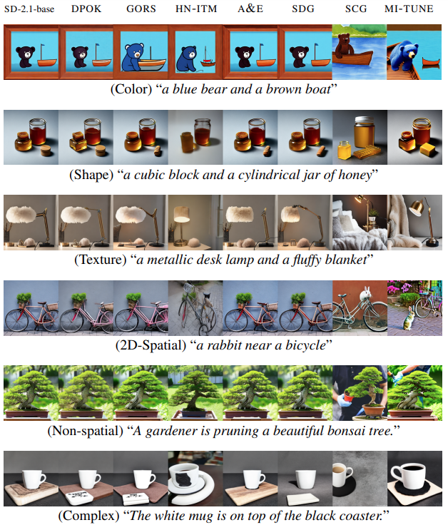

# Information Theoretic Text-to-Image Alignment

This repository is the official implementation of ICLR 2025 paper [Information Theoretic Text-to-Image Alignment](https://arxiv.org/abs/2405.20759), led by

[Chao Wang](https://scholar.google.com/citations?user=uPQKC84AAAAJ&hl=zh-CN), [Giulio Franzese](https://scholar.google.com/citations?user=kEtx_WwAAAAJ&hl=it), [Alessandro Finamore](https://afinamore.io/), [Massimo Gallo](https://gallomassimo.github.io/), [Pietro Michiardi](https://michiard.eurecom.io/). 

[](https://chao0511.github.io/mitune/)
[](https://arxiv.org/abs/2405.20759)

---
## 👀 Summary

We propose MI-TUNE, a novel fine-tuning method for text-to-image generative diffusion models, that uses mutual information to align generated images to user intentions through natural prompts. 





## 🛠️ Setup

Create the environment

```
git clone https://github.com/Chao0511/mitune.git 
cd mitune
cd src
conda env create -f environment.yml
conda activate mitune_env
```


## 🗺️ Usage

MI-TUNE supports the finetuning of diffusion-based models: [stabilityai/stable-diffusion-2-1-base](https://huggingface.co/stabilityai/stable-diffusion-2-1-base) and [stabilityai/stable-diffusion-xl-base-1.0](https://huggingface.co/stabilityai/stable-diffusion-xl-base-1.0).


### Finetuning dataset construction

Build the finetuning dataset by selecting the images with the highest point-wise MI:

```
cd construct_finetuning_dataset
python gen_imgs_save_best_1phase.py \
    --pretrained_model_name_or_path  <path_to_pretrained_model> \
    --dora_ckpt_dir <dora_checkpoint_folder> \
    --prompt_file_name <path_to_training_prompts.txt> \
    --outdir <training_data_folder> 
```


### Finetuning

Finetune the pretrained model on the constructed finetuning dataset:

```
cd ../run_finetuning

# for stable-diffusion-2-1-base:
accelerate launch train_text_to_image_lora_sd2.py \
    --pretrained_model_name_or_path  <path_to_pretrained_model> \
    --seed <seed> \
    --train_data_dir <training_data_folder> \
    --output_dir <lora_checkpoint_folder> \
    --validation_prompts_file  <path_to_validation_prompts.txt> \
    --train_batch_size 8 \
    --gradient_accumulation_steps 50 \
    --learning_rate 1e-4 \
    --max_grad_norm 1.0 \
    --checkpointing_validation_steps 10 \
    --max_train_steps 300 \
    --rank 32 \
    --use_dora


# for stable-diffusion-xl-base-1.0:
accelerate launch train_text_to_image_lora_sdxl.py \
    --pretrained_model_name_or_path  <path_to_pretrained_model> \
    --seed <seed> \
    --train_data_dir <training_data_folder> \
    --output_dir <lora_checkpoint_folder> \
    --validation_prompts_file  <path_to_validation_prompts.txt> \
    --train_batch_size 8  \
    --gradient_accumulation_steps 50 \
    --learning_rate 1e-4 \
    --max_grad_norm 1.0 \
    --checkpointing_validation_steps 10 \
    --max_train_steps 300 \
    --rank 32  \
    --use_dora


# for stable-diffusion-3.5-medium:
accelerate launch --multi_gpu --num_processes 6 train_text_to_image_lora_sd3.py \
    --pretrained_model_name_or_path  <path_to_pretrained_model> \
    --seed <seed> \
    --train_data_dir <training_data_folder> \
    --output_dir <lora_checkpoint_folder> \
    --validation_prompts_file  <path_to_validation_prompts.txt> \
    --train_batch_size 8  \
    --gradient_accumulation_steps 5 \
    --learning_rate 5e-6 \
    --max_grad_norm 5e-3 \
    --checkpointing_validation_steps 20 \
    --lr_scheduler constant_with_warmup \
    --lr_warmup_steps 400 \
    --max_train_steps 2000 \
    --rank 32 
```


### Inference

Select the best checkpoint based on validation images, then generate test images:

```
cd ../run_inference
python inference_eval.py \
    --pretrained_model_name_or_path  <path_to_pretrained_model>  \
    --dora_ckpt_dir <dora_checkpoint_folder>  \
    --prompt_file_name <path_to_training_prompts.txt>  \
    --outdir <test_data_folder> 
```


## 🌄 Survey

To run the user study:

```
cd ../survey/src
bash launch_voila.sh
```

Detailed description about the survey is in survey/README.md


## 📝 Citation
If you find our method useful, please cite as below or leave a star to this repository.

```
@inproceedings{wang2025mitune,
  title={Information Theoretic Text-to-Image Alignment}, 
  author={Chao Wang and Giulio Franzese and Alessandro Finamore and Massimo Gallo and Pietro Michiardi},
  year={2025},
  booktitle={The Thirteenth International Conference on Learning Representations},
}
```


## Acknowledge
Most of our code are developed based on [diffusers](https://github.com/huggingface/diffusers) and [T2I-CompBench](https://github.com/Karine-Huang/T2I-CompBench)


## Contact
chao.wang@eurecom.fr