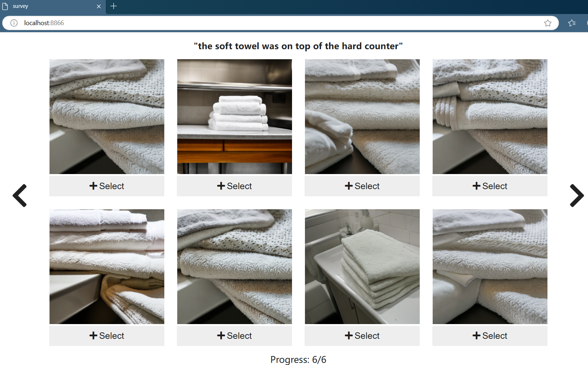

# User survey app

This folder contains a webapp used to investigate
how humans compares different pictures for the same
text prompt.

The webapp is a jupyter notebook that uses [ipywidgets](https://ipywidgets.readthedocs.io/en/stable/)
to compose a user survey. The notebook is transformed
into a webapp using [voila](https://voila.readthedocs.io/en/stable/using.html).

Specifically, the survey is composed of multiple rounds.
In each round the app shows a text prompt and 3 images selected randomly from a predefined pool.
The user needs to select which images better represent each prompt.
As there are no right or wrong answers, users can select from 0 (no images) to 3 images (all images).

## Run the app locally

To run the app locally on the sample images (5 prompts rather than 10) provided in this repository
```
voila survey/src/survey_methods.ipynb

voila survey/src/survey_metrics.ipynb
```

Here an example screenshot



The results are saved under `survey/answers/default`:

* Each survey is saved as a separated CSV with the filename
representing the timestamp of when is generated.

* In the CSV each row collect the prompt and a set of True/False
values mapped to the user selection.
